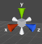

# Unity2DCheatsheet
A cheatsheet for Unity's 2D features. It's based on [this cheat sheet](http://cdn1.raywenderlich.com/wp-content/uploads/2014/11/UnityCheatsheet-0_1.pdf) but I've modified it for 2D.

[Animation](animation.md)

## Non-physics movement

```
Transform.position = Vector2.Lerp(...)
Transform.translate
```

## Physics 

### Rigidbodies
To make a GameObject under the control of the physics engine, add a ```Rigidbody2D```component.

With ```Rigidbodies2D``` do not attempt to move them by ```Transform``` properties (rotation, scale, position). Instead apply forces.

### Colliders

```C#
BoxCollider2D
CircleCollider2D
PolygonCollider2D
```

### Floors, walls, and other motionless elements
Add a collider to an object, but don't add a Rigidbody component.

### Collisions

```C#
OnCollisionEnter2D
OnCollisionExit2D
OnCollisionStay2D

```


### Triggers

```C#
OnTriggerEnter2D
OnTriggerExit2D
OnTriggerStay2D

```

### Destroy

Removes a game object, component or asset

```C#
Destroy (myObject);
```

### Spawn (instantiate)

```C#
Instantiate(gameObject, position, Quaternion.identity)A as GameObject;
```

## GameObject Events

###Update()
Called once per frame.

###FixedUpdate()
Called multiple times per frame.
Should be used when applying forces or other physics related functions.

### LastUpdate()
Called  once  per frame after Update()  has finished. 
Good  for camera  movement.

#### How to crash unity: Use a ```loop``` (for, while) inside of Update(), FixedUpdate(), or LastUpdate().


##Input

### Conventional

```C#
Input.GetAxis("Horizontal")
Input.GetAxis("Vertical")
```

### Mobile

Mobile uses an Input.Touch data structure.

Useful properties include ```position``` and ```deltaPosition``` (change in position since the last frame).


```C#
var particle : GameObject;
function Update () {
    for (var touch : Touch in Input.touches) {
        if (touch.phase == TouchPhase.Began) {
            // Construct a ray from the current touch coordinates
            var ray = Camera.main.ScreenPointToRay (touch.position);
            if (Physics.Raycast (ray)) {
                // Create a particle if hit
                Instantiate (particle, transform.position, transform.rotation);
            }
        }
    }
}
```

## Useful Math Functions
Mathf.Max

Mathf.Min

###Mathf.Clamp
Useful for forcing a player to say within a certain "bounds".

```C#
var pos = transform.position;
pos.x =  Mathf.Clamp(transform.position.x, -2.0f, 2.0f);
```    

Mathf.PingPong

##  Vector Variables

```C#
Vector2D.one
Vector2D.right
Vector2D.up
Vector2D.zero
```

## Timing Variables

```C#
Time.deltaTime
Time.fixedTime
Time.time
Time.timeScale
```

-------

## Controlling the camera
For 2D, don’t mess with the Scene Gizmo. In Unity 5 the gizmo isn't even available when viewing in "2D" mode:


``` don't mess with this guy ```

If you mess with the Scene Gizmo and can't get back to your original camera position, close the ```Scene Tab``` and then reopen it.


## Vertex snapping

When you are building tiles for your game, its easier if they just "snap" together.

However this feature is hard to find (there's no View > grid > snap to grid or anything Photoshop-like).

Snapping items together is called ```vertex snapping```.

```
V + click + drag
```

## Renaming a project
Quit Unity.

Rename the folder that contains the Unity project. 

Restart Unity.

Click ```Open Other``` and choose the folder you just renamed.


