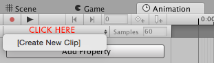

## Animation set up

### Method One
Select a Sprite Animation (Shift + click to select all the frames) from your project folder and drag it to your Game Object. You will be prompted to name your animation. This will automatically set up an Animator component, with an animator controller, and the animation you just created.

### Method Two
To your character game object, add an Animator Component.

Then ```Create > Animator Controller```.

Drag the new Animator Controller to your "Controller" box in the "Animator Component".

View your Animation window. ```Window > Animation```.


Make sure you the character you want to set up animations for, and then ```Create > New Clip```.



Name the new animation.

Then drag your animation to the timeline.

Create another animation with the same process.